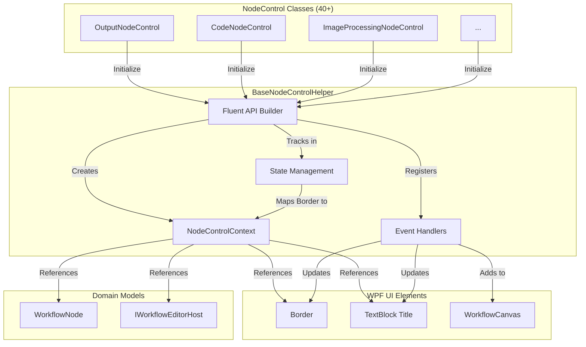
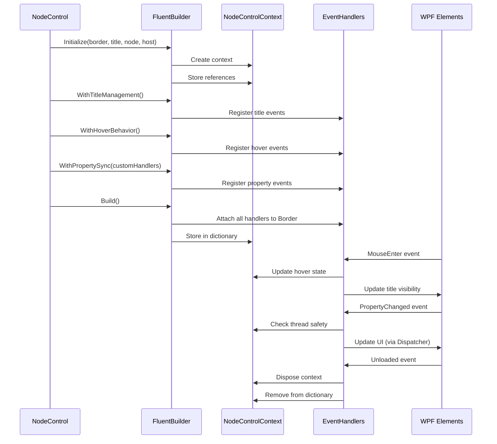

# Design Document

## Overview

This design document specifies the architecture for refactoring 40+ NodeControl classes to eliminate 60-70% code duplication by extracting common logic into a `BaseNodeControlHelper` class with a fluent API design. The refactoring will reduce typical NodeControl class sizes from 400-500 lines to 120-200 lines while maintaining full backward compatibility and improving maintainability.

### Problem Statement

The current codebase contains significant duplication across NodeControl classes:
- **Title management logic**: Creating, positioning, and updating title TextBlocks
- **Hover event handling**: MouseEnter/MouseLeave with focus management
- **Keyboard port positioning**: Arrow key handlers for port position changes
- **Property change handlers**: Thread-safe UI updates from INotifyPropertyChanged events
- **Zoom handling**: Hiding titles during zoom and restoring after zoom completes
- **Cleanup logic**: Unloaded event handlers to prevent memory leaks
- **Dialog management**: Right-click dialog opening with state management
- **Visibility synchronization**: Title visibility tracking border visibility for viewport culling
- **Canvas integration**: Adding title TextBlocks to WorkflowCanvas with proper ZIndex
- **Throttling logic**: DispatcherTimer-based throttling for title position updates

### Solution Approach

Extract all common patterns into a `BaseNodeControlHelper` class that provides:
1. **Fluent API** for clean, readable configuration
2. **NodeControlContext** object for centralized state management
3. **Grouped event registration** methods for logical organization
4. **Thread-safe operations** with automatic Dispatcher marshaling
5. **Centralized state tracking** using ConcurrentDictionary
6. **Extensibility points** for node-specific customization

## Architecture

### High-Level Component Diagram



### Class Interaction Sequence



## Components and Interfaces

### 1. BaseNodeControlHelper (Static Class)

The main helper class providing fluent API and common logic.

```csharp
public static class BaseNodeControlHelper
{
    // Centralized state tracking
    private static readonly ConcurrentDictionary<Border, NodeControlContext> _contexts = new();
    
    // Public API
    public static FluentBuilder Initialize(
        Border border,
        TextBlock titleTextBlock,
        WorkflowNode node,
        IWorkflowEditorHost host);
    
    public static NodeControlContext? GetContext(Border border);
    public static void RemoveContext(Border border);
    
    // Brush resolution
    public static Brush ResolveTextOnColorBrush(string colorKey);
    public static Brush ResolveTitleBrush(
        TitleColorMode mode,
        string? titleColorKey,
        Brush nodeBrush);
    
    // Dialog manager resolution
    public static NodeDialogManager GetOrCreateDialogManager(IWorkflowEditorHost host);
    
    // Position calculation
    public static (double left, double top) CalculateTitlePosition(
        Border border,
        TextBlock titleTextBlock,
        IWorkflowEditorHost host);
}
```

### 2. FluentBuilder (Nested Class)

Provides fluent API for configuring node control behaviors.

```csharp
public class FluentBuilder
{
    private readonly NodeControlContext _context;
    private readonly List<Action> _eventRegistrations = new();
    
    // Configuration methods (return this for chaining)
    public FluentBuilder WithTitleManagement();
    public FluentBuilder WithHoverBehavior();
    public FluentBuilder WithKeyboardPorts();
    public FluentBuilder WithPropertySync(
        Dictionary<string, Action<NodeControlContext>>? customHandlers = null);
    public FluentBuilder WithZoomHandling();
    public FluentBuilder WithDialogSupport(Func<NodeControlContext, object> dialogFactory);
    public FluentBuilder WithCleanup();
    public FluentBuilder WithVisibilitySync();
    public FluentBuilder WithCanvasIntegration();
    
    // Terminal method
    public NodeControlContext Build();
}
```

### 3. NodeControlContext (Class)

Encapsulates all state needed for node control operations.

```csharp
public class NodeControlContext : IDisposable
{
    // Core references
    public Border Border { get; }
    public TextBlock TitleTextBlock { get; }
    public WorkflowNode Node { get; }
    public IWorkflowEditorHost Host { get; }
    
    // State tracking
    public bool IsHovered { get; set; }
    public bool IsZooming { get; set; }
    public bool TitleUpdatedAfterZoom { get; set; }
    
    // Throttling
    public DispatcherTimer? TitleUpdateTimer { get; set; }
    
    // Methods
    public Dispatcher? GetDispatcher();
    public bool IsBorderVisible();
    public void UpdateHoverState(bool isHovered);
    public void Dispose();
}
```

### 4. Event Handler Methods

Internal methods for handling specific events.

```csharp
// Title management
internal static TextBlock CreateTitleTextBlock(
    WorkflowNode node,
    TitleDisplayMode displayMode,
    bool isHovered);

internal static void UpdateTitleVisibility(
    NodeControlContext context,
    TitleDisplayMode mode,
    bool isHovered);

internal static void UpdateTitlePosition(NodeControlContext context);

internal static void ScheduleThrottledTitleUpdate(
    NodeControlContext context,
    int throttleMs = 50);

// Hover handling
internal static void HandleMouseEnter(NodeControlContext context);
internal static void HandleMouseLeave(NodeControlContext context);

// Keyboard port positioning
internal static void HandleKeyboardPortPositioning(
    NodeControlContext context,
    KeyEventArgs e);

// Property change handling
internal static void HandlePropertyChanged(
    NodeControlContext context,
    string? propertyName,
    Dictionary<string, Action<NodeControlContext>>? customHandlers = null);

internal static void RegisterPropertyHandler(
    Dictionary<string, Action<NodeControlContext>> handlers,
    string propertyName,
    Action<NodeControlContext> action);

// Zoom handling
internal static void HandleLayoutUpdated(NodeControlContext context);

// Cleanup
internal static void HandleUnloaded(NodeControlContext context);

// Dialog management
internal static void HandleMouseRightButtonUp(
    NodeControlContext context,
    MouseButtonEventArgs e,
    Func<NodeControlContext, object> dialogFactory);

// Visibility synchronization
internal static void HandleVisibilityChanged(NodeControlContext context);

// Canvas integration
internal static void HandleLoaded(NodeControlContext context);

// Size change handling
internal static void HandleSizeChanged(NodeControlContext context);
```

### 5. Grouped Event Registration Methods

Methods that register multiple related event handlers.

```csharp
internal static void RegisterTitleEvents(NodeControlContext context);
internal static void RegisterInteractionEvents(
    NodeControlContext context,
    Func<NodeControlContext, object>? dialogFactory = null);
internal static void RegisterLifecycleEvents(NodeControlContext context);
internal static void RegisterPropertyEvents(
    NodeControlContext context,
    Dictionary<string, Action<NodeControlContext>>? customHandlers = null);
internal static void RegisterVisibilityEvents(NodeControlContext context);
```

## Data Models

### NodeControlContext State

```csharp
public class NodeControlContext
{
    // Immutable references (set in constructor)
    public Border Border { get; }
    public TextBlock TitleTextBlock { get; }
    public WorkflowNode Node { get; }
    public IWorkflowEditorHost Host { get; }
    
    // Mutable state
    public bool IsHovered { get; set; }
    public bool IsZooming { get; set; }
    public bool TitleUpdatedAfterZoom { get; set; }
    public DispatcherTimer? TitleUpdateTimer { get; set; }
    
    // Event handler references (for cleanup)
    private readonly List<(object target, Delegate handler)> _eventHandlers = new();
    
    public void TrackEventHandler(object target, Delegate handler)
    {
        _eventHandlers.Add((target, handler));
    }
    
    public void UnregisterAllEventHandlers()
    {
        foreach (var (target, handler) in _eventHandlers)
        {
            // Unregister using reflection or specific unregister methods
        }
        _eventHandlers.Clear();
    }
}
```

### Configuration Objects

```csharp
public class TitleManagementConfig
{
    public TitleDisplayMode DisplayMode { get; set; }
    public TitleColorMode ColorMode { get; set; }
    public string? ColorKey { get; set; }
    public int ThrottleMs { get; set; } = 50;
}

public class PropertySyncConfig
{
    public Dictionary<string, Action<NodeControlContext>> CustomHandlers { get; set; } = new();
    public bool SyncColorKey { get; set; } = true;
    public bool SyncNodeBrush { get; set; } = true;
    public bool SyncTitle { get; set; } = true;
    public bool SyncTitleDisplayMode { get; set; } = true;
}
```

## Error Handling

### Thread Safety Strategy

All UI update methods will implement the following pattern:

```csharp
internal static void UpdateUI(NodeControlContext context, Action updateAction)
{
    var dispatcher = context.GetDispatcher();
    if (dispatcher == null) return;
    
    if (dispatcher.CheckAccess())
    {
        updateAction();
    }
    else
    {
        dispatcher.BeginInvoke(updateAction, DispatcherPriority.Normal);
    }
}
```

### Exception Handling

1. **Cleanup operations**: Suppress exceptions to avoid crashing unload path
2. **Dialog operations**: Show MessageBox with error details
3. **Property change handlers**: Log errors but continue processing
4. **Event registration**: Validate parameters and throw ArgumentException for invalid input

```csharp
internal static void HandleUnloaded(NodeControlContext context)
{
    try
    {
        context.TitleUpdateTimer?.Stop();
        context.TitleUpdateTimer = null;
        
        if (context.Host.WorkflowCanvas?.Children.Contains(context.TitleTextBlock) == true)
        {
            context.Host.WorkflowCanvas.Children.Remove(context.TitleTextBlock);
        }
        
        if (ReferenceEquals(context.Node.TitleTextBlockUI, context.TitleTextBlock))
        {
            context.Node.TitleTextBlockUI = null;
        }
        
        context.UnregisterAllEventHandlers();
        RemoveContext(context.Border);
    }
    catch
    {
        // Best-effort cleanup; suppress to avoid crashing unload path
    }
}
```

## Testing Strategy

### Unit Testing Approach

This refactoring is primarily about **code organization and extraction**, not algorithmic logic or data transformation. The extracted code already exists and is tested through the application's existing usage. Therefore, **property-based testing is NOT appropriate** for this refactoring.

**Why PBT Does Not Apply:**

1. **No universal properties to test**: The refactoring extracts UI event handlers and state management code. There are no "for all inputs X, property P(X) holds" statements that make sense here.

2. **Side-effect-only operations**: Most extracted methods perform side effects (updating UI, registering events, managing state) with no return values to assert properties on.

3. **UI rendering and interaction**: The code deals with WPF UI elements, event handlers, and visual updates — areas where PBT is explicitly not appropriate (per the workflow guidelines).

4. **Configuration and setup**: Much of the helper class is about wiring up event handlers and managing lifecycle — configuration validation territory, not property testing territory.

**Appropriate Testing Strategy:**

1. **Example-Based Unit Tests**:
   - Test specific scenarios with concrete examples
   - Verify event handler registration
   - Verify state transitions (hover on/off, zoom start/end)
   - Verify thread marshaling behavior
   - Verify cleanup operations

2. **Integration Tests**:
   - Test full NodeControl initialization flow
   - Verify UI updates in response to property changes
   - Verify dialog opening behavior
   - Test with real WPF Dispatcher

3. **Manual Testing**:
   - Visual verification of title positioning
   - Hover behavior testing
   - Zoom behavior testing
   - Memory leak verification (using profiler)

4. **Regression Testing**:
   - Compare refactored NodeControl behavior with original implementation
   - Verify backward compatibility
   - Test all 40+ NodeControl classes after migration

### Test Coverage Goals

1. **FluentBuilder API**:
   - Test method chaining works correctly
   - Test Build() creates and stores context
   - Test optional configuration methods can be omitted

2. **NodeControlContext**:
   - Test Dispose() cleans up resources
   - Test GetDispatcher() returns correct dispatcher
   - Test state property updates

3. **Event Handlers**:
   - Test HandleMouseEnter updates hover state and title visibility
   - Test HandleMouseLeave updates hover state and title visibility
   - Test HandleKeyboardPortPositioning changes port positions correctly
   - Test HandlePropertyChanged dispatches to UI thread when needed
   - Test HandleUnloaded performs cleanup without exceptions

4. **Thread Safety**:
   - Test UI updates from background thread use Dispatcher
   - Test UI updates from UI thread execute directly
   - Test null dispatcher is handled gracefully

5. **State Management**:
   - Test context is stored in dictionary on Build()
   - Test context is removed from dictionary on Unloaded
   - Test GetContext returns correct context for border

### Example Unit Tests

```csharp
[TestClass]
public class BaseNodeControlHelperTests
{
    [TestMethod]
    public void FluentBuilder_WithTitleManagement_RegistersTitleEvents()
    {
        // Arrange
        var border = new Border();
        var title = new TextBlock();
        var node = new OutputNode();
        var host = Mock.Of<IWorkflowEditorHost>();
        
        // Act
        var context = BaseNodeControlHelper
            .Initialize(border, title, node, host)
            .WithTitleManagement()
            .Build();
        
        // Assert
        Assert.IsNotNull(context);
        Assert.AreEqual(border, context.Border);
        // Verify events are registered (check event handler count or trigger event)
    }
    
    [TestMethod]
    public void HandleMouseEnter_UpdatesHoverState_AndShowsTitle()
    {
        // Arrange
        var context = CreateTestContext();
        context.Node.TitleDisplayMode = TitleDisplayMode.Hover;
        context.TitleTextBlock.Visibility = Visibility.Collapsed;
        
        // Act
        BaseNodeControlHelper.HandleMouseEnter(context);
        
        // Assert
        Assert.IsTrue(context.IsHovered);
        Assert.AreEqual(Visibility.Visible, context.TitleTextBlock.Visibility);
    }
    
    [TestMethod]
    public void HandleUnloaded_CleansUpResources_WithoutException()
    {
        // Arrange
        var context = CreateTestContext();
        context.TitleUpdateTimer = new DispatcherTimer();
        
        // Act & Assert (should not throw)
        BaseNodeControlHelper.HandleUnloaded(context);
        
        // Verify cleanup
        Assert.IsNull(BaseNodeControlHelper.GetContext(context.Border));
    }
}
```

## Migration Strategy

### Phase 1: Create BaseNodeControlHelper

1. Create `BaseNodeControlHelper.cs` in `Views/NodeControls/` directory
2. Implement `NodeControlContext` class
3. Implement `FluentBuilder` class with all configuration methods
4. Implement all internal event handler methods
5. Implement centralized state tracking with `ConcurrentDictionary`
6. Add unit tests for helper class

### Phase 2: Pilot Migration

1. Select 2-3 representative NodeControl classes for pilot migration:
   - `OutputNodeControl` (simple, standard pattern)
   - `CodeNodeControl` (medium complexity)
   - `ImageProcessingNodeControl` (complex with resize handles)

2. Refactor each pilot class to use `BaseNodeControlHelper`
3. Test thoroughly to verify backward compatibility
4. Measure code reduction (should be 60-70%)
5. Gather feedback and refine API if needed

### Phase 3: Incremental Migration

1. Migrate NodeControl classes in batches of 5-10
2. Test each batch before proceeding
3. Track progress and code reduction metrics
4. Document any node-specific patterns that emerge

### Phase 4: Cleanup and Documentation

1. Remove old helper methods from migrated classes
2. Update documentation with new implementation pattern
3. Create migration guide for future NodeControl classes
4. Conduct final regression testing

### Rollback Strategy

If issues are discovered during migration:
1. Each NodeControl class can be reverted independently
2. `BaseNodeControlHelper` can coexist with old implementations
3. No changes to shared interfaces or models required
4. Git history provides easy rollback path

## Example Usage

### Before Refactoring (OutputNodeControl.cs - 500 lines)

```csharp
public static class OutputNodeControl
{
    private static readonly Dictionary<Border, DispatcherTimer> _titleUpdateTimers = new();
    private static readonly Dictionary<Border, bool> _titleUpdatedAfterZoom = new();
    
    public static Border CreateBorder(OutputNode node, Window? ownerWindow, IWorkflowEditorHost? host)
    {
        // 50 lines: Create grid, icon, title
        var grid = new Grid { ... };
        var iconSvg = new SvgViewboxEx { ... };
        var titleTextBlock = new TextBlock { ... };
        var border = new Border { ... };
        
        // 30 lines: PropertyChanged handler with thread safety
        if (node is INotifyPropertyChanged npc)
        {
            npc.PropertyChanged += (s, e) => { ... };
        }
        
        // 40 lines: MouseEnter/MouseLeave handlers
        border.MouseEnter += (s, e) => { ... };
        border.MouseLeave += (s, e) => { ... };
        
        // 30 lines: Keyboard port positioning
        border.PreviewKeyDown += (s, e) => { ... };
        
        // 20 lines: Right-click dialog
        border.MouseRightButtonUp += (s, e) => { ... };
        
        // 40 lines: Visibility sync
        var visibilityDescriptor = DependencyPropertyDescriptor.FromProperty(...);
        visibilityDescriptor?.AddValueChanged(border, (s, e) => { ... });
        
        // 30 lines: Loaded handler
        border.Loaded += (s, e) => { ... };
        
        // 20 lines: SizeChanged handler
        border.SizeChanged += (s, e) => { ... };
        
        // 50 lines: Unloaded cleanup
        border.Unloaded += (s, e) => { ... };
        
        // 100 lines: LayoutUpdated with zoom handling and throttling
        border.LayoutUpdated += (s, e) => { ... };
        
        return border;
    }
    
    // 150 lines: Helper methods (UpdateTitlePosition, UpdateTitleVisibility, etc.)
}
```

### After Refactoring (OutputNodeControl.cs - 150 lines)

```csharp
public static class OutputNodeControl
{
    public static Border CreateBorder(OutputNode node, Window? ownerWindow, IWorkflowEditorHost? host)
    {
        if (host == null) throw new ArgumentNullException(nameof(host));
        
        // Create UI elements (node-specific)
        var grid = new Grid { MinWidth = 60, MinHeight = 60, Width = 60, Height = 60 };
        
        var iconConverter = new IconKeyToPathConverter();
        var iconUri = iconConverter.Convert(null, typeof(Uri), 
            "right-to-dotted-line duotone-regular", 
            System.Globalization.CultureInfo.CurrentCulture) as Uri;
        var iconSvg = new SvgViewboxEx
        {
            Source = iconUri,
            Width = 32,
            Height = 32,
            HorizontalAlignment = HorizontalAlignment.Center,
            VerticalAlignment = VerticalAlignment.Center,
            Fill = BaseNodeControlHelper.ResolveTextOnColorBrush(node.ColorKey)
        };
        grid.Children.Add(iconSvg);
        
        var titleTextBlock = new TextBlock
        {
            Text = node.Title ?? "Output",
            FontSize = 12,
            FontWeight = FontWeights.SemiBold,
            Foreground = BaseNodeControlHelper.ResolveTitleBrush(
                node.TitleColorMode, 
                node.TitleColorKey, 
                node.NodeBrush),
            HorizontalAlignment = HorizontalAlignment.Center,
            VerticalAlignment = VerticalAlignment.Top,
            TextAlignment = TextAlignment.Center,
            IsHitTestVisible = false
        };
        
        node.TitleTextBlockUI = titleTextBlock;
        
        var border = new Border
        {
            Child = grid,
            Background = node.NodeBrush,
            BorderBrush = new SolidColorBrush(Colors.White),
            BorderThickness = new Thickness(2),
            CornerRadius = new CornerRadius(10),
            Cursor = Cursors.Hand,
            Effect = new DropShadowEffect
            {
                Color = Colors.Black,
                Direction = 270,
                ShadowDepth = 5,
                BlurRadius = 10,
                Opacity = 0.5
            },
            Tag = node
        };
        
        // Node-specific property handlers
        var customPropertyHandlers = new Dictionary<string, Action<NodeControlContext>>
        {
            [nameof(WorkflowNode.ColorKey)] = ctx =>
            {
                iconSvg.Fill = BaseNodeControlHelper.ResolveTextOnColorBrush(node.ColorKey);
            }
        };
        
        // Initialize with fluent API (replaces 400+ lines of duplicated code)
        BaseNodeControlHelper
            .Initialize(border, titleTextBlock, node, host)
            .WithTitleManagement()
            .WithHoverBehavior()
            .WithKeyboardPorts()
            .WithPropertySync(customPropertyHandlers)
            .WithZoomHandling()
            .WithDialogSupport(ctx => new OutputNodeDialog(node, host, ownerWindow ?? Application.Current?.MainWindow))
            .WithCleanup()
            .WithVisibilitySync()
            .WithCanvasIntegration()
            .Build();
        
        return border;
    }
}
```

### Code Reduction Metrics

| Aspect | Before | After | Reduction |
|--------|--------|-------|-----------|
| Total Lines | 500 | 150 | 70% |
| Event Handler Lines | 350 | 10 | 97% |
| Helper Method Lines | 150 | 0 | 100% |
| Node-Specific Lines | 50 | 140 | -180% (more focused) |

## Appendix: Detailed Method Specifications

### FluentBuilder.WithTitleManagement()

**Purpose**: Configure title creation, visibility, and positioning logic.

**Implementation**:
```csharp
public FluentBuilder WithTitleManagement()
{
    _eventRegistrations.Add(() =>
    {
        RegisterTitleEvents(_context);
    });
    return this;
}
```

**Registers**:
- `Border.Loaded`: Add title to canvas, set ZIndex, update visibility and position
- `Border.SizeChanged`: Update title position
- `Border.LayoutUpdated`: Handle zoom and throttled position updates

### FluentBuilder.WithHoverBehavior()

**Purpose**: Configure mouse enter/leave handlers for hover effects.

**Implementation**:
```csharp
public FluentBuilder WithHoverBehavior()
{
    _eventRegistrations.Add(() =>
    {
        _context.Border.Focusable = true;
        _context.Border.FocusVisualStyle = null;
        
        _context.Border.MouseEnter += (s, e) => HandleMouseEnter(_context);
        _context.Border.MouseLeave += (s, e) => HandleMouseLeave(_context);
    });
    return this;
}
```

**Registers**:
- `Border.MouseEnter`: Update hover state, show title (if Hover mode), set focus
- `Border.MouseLeave`: Update hover state, hide title (if Hover mode)

### FluentBuilder.WithKeyboardPorts()

**Purpose**: Configure arrow key handlers for port position changes.

**Implementation**:
```csharp
public FluentBuilder WithKeyboardPorts()
{
    _eventRegistrations.Add(() =>
    {
        _context.Border.PreviewKeyDown += (s, e) => HandleKeyboardPortPositioning(_context, e);
    });
    return this;
}
```

**Registers**:
- `Border.PreviewKeyDown`: Handle arrow keys to change port positions

### FluentBuilder.WithPropertySync()

**Purpose**: Configure PropertyChanged handlers for UI updates.

**Implementation**:
```csharp
public FluentBuilder WithPropertySync(
    Dictionary<string, Action<NodeControlContext>>? customHandlers = null)
{
    _eventRegistrations.Add(() =>
    {
        RegisterPropertyEvents(_context, customHandlers);
    });
    return this;
}
```

**Registers**:
- `INotifyPropertyChanged.PropertyChanged`: Handle property changes with thread safety

**Default Handlers**:
- `NodeBrush`: Update border background and title foreground
- `Title`: Update title text and position
- `TitleDisplayMode`: Update title visibility
- `TitleColorMode`, `TitleColorKey`: Update title foreground

### FluentBuilder.WithZoomHandling()

**Purpose**: Configure zoom detection and title hiding during zoom.

**Implementation**: Integrated into `LayoutUpdated` handler registered by `WithTitleManagement()`.

**Behavior**:
- Hide title when `NodeChrome.IsZooming` is true
- Restore title visibility when zoom completes
- Skip throttled updates during pan or drag

### FluentBuilder.WithDialogSupport()

**Purpose**: Configure right-click dialog opening.

**Implementation**:
```csharp
public FluentBuilder WithDialogSupport(Func<NodeControlContext, object> dialogFactory)
{
    _eventRegistrations.Add(() =>
    {
        _context.Border.MouseRightButtonUp += (s, e) => 
            HandleMouseRightButtonUp(_context, e, dialogFactory);
    });
    return this;
}
```

**Registers**:
- `Border.MouseRightButtonUp`: Open dialog using provided factory

### FluentBuilder.WithCleanup()

**Purpose**: Configure cleanup logic for Unloaded event.

**Implementation**:
```csharp
public FluentBuilder WithCleanup()
{
    _eventRegistrations.Add(() =>
    {
        _context.Border.Unloaded += (s, e) => HandleUnloaded(_context);
    });
    return this;
}
```

**Registers**:
- `Border.Unloaded`: Stop timers, remove title from canvas, clear references, dispose context

### FluentBuilder.WithVisibilitySync()

**Purpose**: Configure title visibility synchronization with border visibility.

**Implementation**:
```csharp
public FluentBuilder WithVisibilitySync()
{
    _eventRegistrations.Add(() =>
    {
        var descriptor = DependencyPropertyDescriptor.FromProperty(
            UIElement.VisibilityProperty, typeof(Border));
        descriptor?.AddValueChanged(_context.Border, (s, e) => 
            HandleVisibilityChanged(_context));
    });
    return this;
}
```

**Registers**:
- `Border.Visibility` property change: Update title visibility

### FluentBuilder.WithCanvasIntegration()

**Purpose**: Configure canvas integration for title TextBlock.

**Implementation**: Integrated into `Loaded` handler registered by `WithTitleManagement()`.

**Behavior**:
- Add title to `WorkflowCanvas` when border loads
- Set ZIndex to 20000
- Update visibility and position

### FluentBuilder.Build()

**Purpose**: Apply all configurations and return the context.

**Implementation**:
```csharp
public NodeControlContext Build()
{
    // Execute all registered event registrations
    foreach (var registration in _eventRegistrations)
    {
        registration();
    }
    
    // Store context in centralized dictionary
    _contexts[_context.Border] = _context;
    
    return _context;
}
```

---

**End of Design Document**
