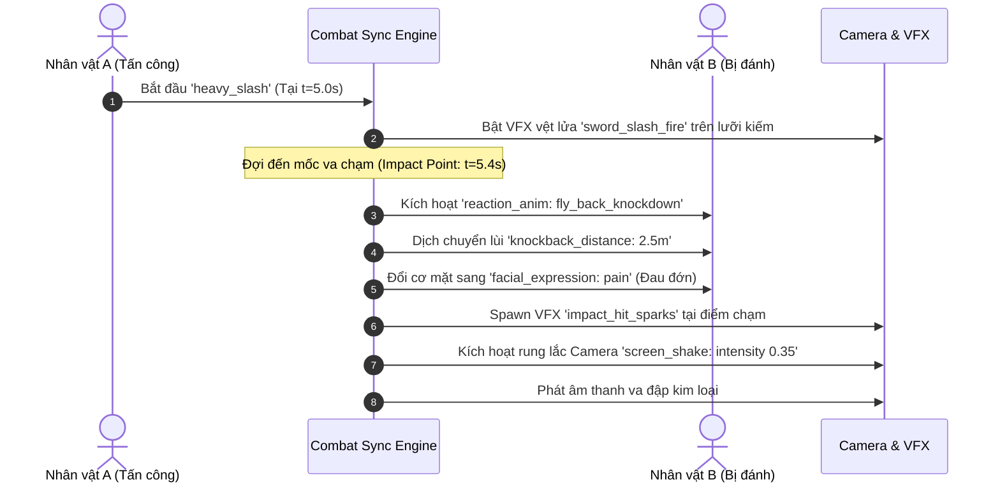

# Master Plan Toàn Diện: AI 3D Animation Studio (All-in-One Project)

Dự án là một **Studio làm phim hoạt ảnh 3D tự động hóa bằng AI**, nơi AI đóng vai trò Đạo diễn toàn năng. AI tự động quét kho tài nguyên, hiểu không gian map, tự biên đạo chuyển động (né vật cản, ngồi ghế, trèo cây, gieo hạt nảy mầm, combat võ thuật có hiệu ứng va chạm chi tiết), quản lý thoại với `audio_path: null` để tự động render Text-to-Speech (TTS), điều khiển 52 cơ mặt và xuất video hoàn chỉnh.

---

## 1. Ma Trận Tính Năng Hệ Thống (Feature Matrix)

| Nhóm Tính Năng | Cơ Chế Xử Lý | Mục Tiêu Đạt Được |
| :--- | :--- | :--- |
| **Asset Discovery** | Tự động quét `public/assets/` sinh `asset_catalog.json` | AI biết chính xác có bao nhiêu nhân vật, trang phục, vũ khí, hiệu ứng, animation và cách dùng. |
| **Dialogue & TTS Pipeline** | Quản lý text thoại với `audio_path: null` + Auto Fill | AI xuất kịch bản thoại với audio trống; sau khi render TTS sẽ tự động điền path và cập nhật duration cho timeline & lip-sync. |
| **Combat & Tác động lực** | `CombatSyncEngine` + Hit Impact Frame + Screen Shake | Đòn đánh vung kiếm (VFX vệt sáng) -> Khớp đúng millisecond va chạm -> Đối thủ văng lùi, đổi mặt đau đớn, nổ tia lửa VFX, rung camera. |
| **Không gian & Va chạm** | `three-pathfinding` (NavMesh) + `SpatialRegistry` | AI hiểu tọa độ cây cối, bờ tường; nhân vật tự đi vòng né vật cản, không bị đi xuyên tường. |
| **Smart Objects** | `SmartSocketRegistry` (Ghế, Cây, Ruộng) | Ngồi ghế tự căn góc xoay mông; trèo cây theo đường dốc cành; ruộng đất gieo hạt và nảy mầm theo giây. |
| **Biểu cảm & Thoại** | 52 Blendshapes VRM + `VisemeLipSync` + `LookAt IK` | Mở miệng theo âm thanh thoại (A-I-U-E-O), chớp mắt tự nhiên, đổi cảm xúc, mắt nhìn theo mục tiêu. |
| **Preview & Render** | WebGL Live Preview 60fps + `WebCodecs`/`FFmpeg` | Tua mượt mà trên Timeline, xoay camera kiểm tra tự do; xuất file MP4 chất lượng cao. |
| **Chuẩn Code** | Strict Modularization (< 800 - 1000 dòng/file) | Tách nhỏ logic độc lập, dễ mở rộng và bảo trì lâu dài. |

---

## 2. Hệ Thống Combat & Tác Động Lực Đồng Bộ Chi Tiết (Combat Choreography)

Cảnh chiến đấu (Combat) giữa các nhân vật đòi hỏi sự chính xác tuyệt đối đến từng khung hình (frame-accurate synchronization):



### Các thông số cốt lõi trong Combat Action:
1. **`start_time` & `impact_time`**: 
   * `start_time` (VD: 5.0s): Nhân vật A bắt đầu lấy đà vung kiếm, gắn VFX vệt sáng (`sword_slash_fire`) vào đầu mũi kiếm (`weapon_tip`).
   * `impact_time` (VD: 5.4s): Thời điểm chính xác lưỡi kiếm chạm vào cơ thể nhân vật B.
2. **Khớp phản ứng của đối thủ (`target_reaction`) ngay tại `impact_time`:**
   * **Animation phản ứng:** Chuyển ngay sang `fly_back_knockdown` hoặc `stagger_back`.
   * **Tác động lực lùi (`knockback_distance`):** Nhân vật B bị đẩy lùi theo hướng vector ngược lại (VD: 2.5m).
   * **Biểu cảm khuôn mặt:** Lập tức đổi sang `pain` (nhăn mặt đau đớn).
3. **Hiệu ứng môi trường & Camera:**
   * **VFX Va chạm:** Bùng nổ tia lửa `impact_hit_sparks` tại vị trí tiếp xúc.
   * **Rung Camera (`screen_shake`):** Rung ống kính máy quay (`intensity: 0.35`, `duration: 0.25s`) tạo cảm giác uy lực cho cú đánh.

---

## 3. Pipeline Quản Lý Lời Thoại & Quy Tắc `audio_path: null` (TTS Pipeline)

Khi AI sinh ra kịch bản ban đầu, file âm thanh **chưa tồn tại**. Vì vậy, hệ thống sử dụng quy tắc `audio_path: null` kèm định danh tự động để dễ dàng render TTS và điền ngược lại vào JSON:

```mermaid
flowchart TD
    A[AI Director: Sinh JSON Kịch bản thoại\naudio_path = null] --> B[Dialogue Manager & Extractor]
    B --> C[Xuất file danh sách: dialogue_manifest.json]
    C --> D[TTS Batch Generator\n(Edge-TTS / ElevenLabs / OpenAI TTS)]
    D --> E[Lưu file âm thanh vào public/assets/audio/dialogues/...]
    E --> F[Auto-fill: Cập nhật audio_path & duration thực tế vào JSON]
    F --> G[Timeline Engine & ActorLipSync: Nhép miệng Viseme A-I-U-E-O]
```

### Quy tắc hoạt động của `audio_path: null` và Auto-Fill:
1. **Trạng thái ban đầu (AI sinh ra):**
   ```json
   {
     "line_id": "dlg_01",
     "speaker_id": "actor_warrior",
     "text": "Ngươi đã chuẩn bị tinh thần để đền tội chưa?",
     "voice_config": {
       "voice_id": "vi-VN-NamMinhNeural",
       "speed": 1.0,
       "emotion": "angry"
     },
     "audio_path": null,
     "audio_naming_rule": "audio/dialogues/{scene_id}_{speaker_id}_{line_id}.mp3",
     "estimated_duration": 3.0,
     "status": "pending_tts"
   }
   ```
2. **Chế độ xem trước tức thì (Instant Preview khi `audio_path: null`):**
   * Hệ thống tự động dùng **Web Speech API tích hợp sẵn trong trình duyệt** hoặc thuật toán đếm âm tiết để mô phỏng cử động miệng và phát giọng đọc thử nghiệm ngay trên màn hình Preview mà không cần đợi render file.
3. **Quy trình Auto-Fill (Sau khi bấm nút "Render TTS"):**
   * `TTSBatchGenerator` tự động đọc danh sách các câu thoại có `audio_path: null` -> Gọi API sinh file MP3 theo đúng tên `audio_naming_rule`.
   * Đọc chính xác độ dài file MP3 thực tế (VD: `3.25s`) và điền lại vào JSON:
     * `audio_path`: `"audio/dialogues/scene_01_actor_warrior_dlg_01.mp3"`
     * `duration`: `3.25`
     * `status`: `"ready"`
   * `ActorLipSync` lập tức phân tích file MP3 này để tạo 52 Visemes chuẩn xác từng mili-giây.

---

## 4. Hệ Thống Tương Tác Vật Thể Thông Minh (Smart Objects & Sockets)

1. **Ngồi ghế chuẩn xác (`ChairInteraction`):**
   * Mỗi chiếc ghế có Socket: `seat_entry` (điểm chân trước ghế) và `sit_target` (tọa độ mông).
   * Nhân vật chạy đến `seat_entry` -> Tự xoay 180° mặt hướng ra ngoài -> Khớp hông vào `sit_target` -> Chuyển sang animation ngồi, không lo bị lơ lửng hay xuyên ghế.
2. **Trèo cây (`ClimbingInteraction`):**
   * Cây cối có các mốc leo dốc `climbing_waypoints`.
   * Nhân vật chuyển sang animation leo trèo, tọa độ nâng dần theo trục thân cây lên nhánh chạc ba (`branch_seat`) rồi ngồi nghỉ.
3. **Mảnh ruộng & Nảy mầm theo thời gian (`FarmingSystem`):**
   * Ô đất có trạng thái (`tilled -> seeded -> sprouting -> mature`).
   * Nhân vật cúi người gieo hạt -> Spawn mầm cây `sprout.glb` với animation scale từ `0.0 -> 1.0` tăng dần theo mốc giây trên Timeline.

---

## 5. Hệ Thống Tìm Đường & Tránh Va Chạm (NavMesh & Pathfinding)

* Bản đồ 3D đi kèm một lớp lưới phẳng đi bộ (**NavMesh**).
* Cây cối, bờ tường, vực thẳm... được đục lỗ trên NavMesh.
* Khi AI ra lệnh nhân vật di chuyển từ A đến B, thuật toán **A* Search** (`three-pathfinding`) sẽ tự động lái nhân vật đi vòng qua các chướng ngại vật mượt mà, loại bỏ hoàn toàn hiện tượng đi xuyên tường.

---

## 6. Bản Thiết Kế Master JSON Schema Toàn Năng (Đầy Đủ Nhất)

```json
{
  "scene_id": "scene_village_clash",
  "fps": 30,
  "duration": 25.0,
  "environment": {
    "map": "farming_village",
    "sky_time": "sunset",
    "weather": { "fog": 0.01, "wind": 0.3 }
  },
  "dialogues_manifest": [
    {
      "line_id": "dlg_01",
      "speaker_id": "actor_warrior",
      "text": "Ngươi đã chuẩn bị tinh thần để đền tội chưa?",
      "voice_config": {
        "voice_id": "vi-VN-NamMinhNeural",
        "speed": 1.05,
        "pitch": 0.0,
        "emotion": "angry"
      },
      "audio_path": null,
      "audio_naming_rule": "audio/dialogues/{scene_id}_{speaker_id}_{line_id}.mp3",
      "status": "pending_tts",
      "start_time": 2.0,
      "estimated_duration": 3.0
    },
    {
      "line_id": "dlg_02",
      "speaker_id": "actor_dark_mage",
      "text": "Ha ha! Một kẻ như ngươi mà cũng đòi cản đường ta sao?",
      "voice_config": {
        "voice_id": "vi-VN-HoaiMyNeural",
        "speed": 1.0,
        "pitch": 0.1,
        "emotion": "arrogant"
      },
      "audio_path": null,
      "audio_naming_rule": "audio/dialogues/{scene_id}_{speaker_id}_{line_id}.mp3",
      "status": "pending_tts",
      "start_time": 5.5,
      "estimated_duration": 4.0
    }
  ],
  "camera_tracks": [
    {
      "start": 0.0, "end": 5.0,
      "shot_type": "cinematic_dolly",
      "from": [-5, 3, 10], "to": [-1, 1.8, 4],
      "look_at": "actor_warrior.head", "fov": 45
    },
    {
      "start": 8.0, "end": 14.0,
      "shot_type": "combat_action_cam",
      "follow_target": "actor_warrior",
      "distance": 3.5, "height": 1.6, "fov": 60
    }
  ],
  "actors": [
    {
      "id": "actor_warrior",
      "model": "characters/hero_knight.vrm",
      "costume": "default_armor",
      "spawn_point": [-3, 0, 2],
      "tracks": {
        "movement": [
          { "start": 0.0, "end": 2.0, "action": "walk", "destination": [0, 0, 2], "avoid_obstacles": true },
          { "start": 2.0, "end": 8.5, "action": "talk_gesture", "look_at": "actor_dark_mage.head" }
        ],
        "speech": [
          {
            "line_ref": "dlg_01",
            "expressions": [
              { "time_offset": 0.0, "type": "angry", "weight": 1.0 },
              { "time_offset": 2.0, "type": "serious", "weight": 0.8 }
            ]
          }
        ],
        "combat_actions": [
          {
            "start_time": 8.5,
            "impact_time": 9.1,
            "anim": "heavy_slash_combo",
            "weapon_vfx": { "type": "sword_slash_fire", "start": 8.6, "end": 9.3 },
            "target": {
              "actor_id": "actor_dark_mage",
              "reaction_anim": "fly_back_knockdown",
              "knockback_distance": 2.5,
              "facial_expression": "pain",
              "impact_vfx": "impact_hit_sparks",
              "screen_shake": { "intensity": 0.35, "duration": 0.25 }
            }
          }
        ]
      }
    },
    {
      "id": "actor_dark_mage",
      "model": "characters/dark_mage.vrm",
      "spawn_point": [2, 0, 2],
      "tracks": {
        "movement": [
          { "start": 0.0, "end": 8.5, "action": "idle", "look_at": "actor_warrior.head" }
        ],
        "speech": [
          {
            "line_ref": "dlg_02",
            "expressions": [
              { "time_offset": 0.0, "type": "smirk", "weight": 0.9 }
            ]
          }
        ],
        "vfx": [
          { "start": 7.0, "end": 8.5, "type": "magic_shield_barrier", "attach_to": "root" }
        ]
      }
    }
  ],
  "dynamic_world_events": [
    {
      "target": "props.farm_plot_01.crop",
      "growth_timeline": [
        { "time": 2.0, "stage": "seed", "scale": 0.1 },
        { "time": 8.0, "stage": "sprout", "scale": 0.6 },
        { "time": 18.0, "stage": "mature_crop", "scale": 1.0 }
      ]
    }
  ]
}
```

---

## 7. Quy Chuẩn Phân Rã Code Chặt Chẽ (Code Modularization Standards)

> [!IMPORTANT]
> **Quy Tắc Kiến Trúc Bắt Buộc:**
> 1. **Giới hạn số dòng tối đa:** Tuyệt đối **KHÔNG vượt quá 800 - 1000 dòng/file**.
> 2. **Chủ động phân tách:** File đạt từ **400 - 600 dòng** phải phân tách thành các module/class chuyên biệt.
> 3. **Single Responsibility Principle:** Mỗi file chỉ đảm nhiệm 1 nhiệm vụ riêng biệt.

### Bảng Phân Rã Toàn Bộ File Dự Án (Mỗi file ~100-250 dòng):

```
src/
├── core/
│   ├── engine/
│   │   ├── ThreeRenderer.js           # Khởi tạo WebGL Renderer & Canvas (~140 dòng)
│   │   ├── SceneLighting.js           # Hệ thống ánh sáng mặt trời, skybox, bóng (~120 dòng)
│   │   └── PostProcessor.js           # Cinematic DOF, Bloom, Screen Shake (~160 dòng)
│   ├── assets/
│   │   ├── AssetScanner.js            # Quét thư mục assets tạo catalog JSON (~150 dòng)
│   │   ├── AssetLoaderRegistry.js     # Cache loader cho GLTF, VRM, Audio, Textures (~180 dòng)
│   │   └── SocketAttacher.js          # Gắn vũ khí, VFX vào xương (Bone Sockets) (~130 dòng)
│   ├── audio_tts/
│   │   ├── DialogueExtractor.js       # Quản lý danh sách thoại, xuất file manifest (~120 dòng)
│   │   ├── TTSBatchGenerator.js       # Gọi API Edge-TTS / ElevenLabs sinh file MP3 (~180 dòng)
│   │   ├── AudioAutoFiller.js         # Tự động điền audio_path & duration sau render (~110 dòng)
│   │   └── WebSpeechPreviewer.js      # Giọng đọc nháp Web Speech API xem trước tức thì (~100 dòng)
│   ├── actors/
│   │   ├── VRMAvatar.js               # Quản lý avatar VRM, xương, physics tóc (~180 dòng)
│   │   ├── ActorAnimator.js           # Quản lý Animation Mixer & Crossfade (~190 dòng)
│   │   ├── ActorMorphController.js    # 52 Blendshapes biểu cảm (vui, giận, đau) (~150 dòng)
│   │   ├── ActorLipSync.js            # Phân tích Audio -> Viseme A-I-U-E-O (~170 dòng)
│   │   └── ActorLookAt.js             # IK hướng nhìn mắt & đầu theo vật thể (~120 dòng)
│   ├── combat/
│   │   ├── CombatSyncEngine.js        # Khớp đòn đánh -> Frame va chạm -> Hit Reaction (~210 dòng)
│   │   ├── HitBoxDetector.js          # Tính toán khoảng cách và góc va chạm (~140 dòng)
│   │   └── CombatVFXTrigger.js        # Kích hoạt vệt chém, tia lửa, chưởng lực (~160 dòng)
│   ├── interactions/
│   │   ├── SmartSocketRegistry.js     # Danh bạ socket đồ vật (ghế, bàn, cây) (~130 dòng)
│   │   ├── ChairInteraction.js        # Logic căn góc xoay và ngồi ghế mượt mà (~150 dòng)
│   │   ├── ClimbingInteraction.js     # Logic bám và trèo cây theo waypoints (~190 dòng)
│   │   └── FarmingSystem.js           # Logic ô đất, gieo hạt, cây nảy mầm theo giây (~180 dòng)
│   ├── navigation/
│   │   ├── NavMeshManager.js          # Khởi tạo lưới đi bộ từ Map (~160 dòng)
│   │   └── PathNavigator.js           # Lái nhân vật né chướng ngại vật bằng A* (~200 dòng)
│   ├── timeline/
│   │   ├── MasterClock.js             # Đồng hồ Play/Pause/Scrubbing Timeline (~130 dòng)
│   │   └── TrackEvaluator.js          # Bộ phân tích thực thi đa luồng bất đồng bộ (~220 dòng)
│   └── camera/
│       ├── CameraDirector.js          # Điều phối chuyển đổi camera theo kịch bản (~180 dòng)
│       └── CameraFraming.js           # Tính toán góc cận cảnh, toàn cảnh, theo dõi (~150 dòng)
├── ai/
│   ├── catalog_exporter.js            # Xuất tài nguyên gửi vào Prompt AI (~140 dòng)
│   ├── spatial_scanner.js             # Quét tọa độ chướng ngại vật gửi AI (~160 dòng)
│   └── prompt_builder.js              # Tạo System Prompt Đạo Diễn cho AI (~150 dòng)
└── ui/
    ├── ViewportCanvas.jsx             # Màn hình Live Preview 3D (~140 dòng)
    ├── TimelineScrubber.jsx           # Thanh tua thời gian đa tầng (~180 dòng)
    ├── DialogueEditorModal.jsx        # Bảng quản lý thoại & nút bấm Render TTS (~160 dòng)
    ├── MapRadarView.jsx               # Radar 2D soi chướng ngại vật & nhân vật (~190 dòng)
    └── AIChatDirector.jsx             # Khung chat với AI Đạo Diễn (~170 dòng)
```

---

## 8. Lộ Trình Triển Khai Thực Thi

1. **Giai đoạn 1 (Foundation & Asset Discovery):** Khởi tạo khung Vite + React + Three.js; Xây dựng `AssetScanner` và `AssetLoaderRegistry`.
2. **Giai đoạn 2 (Dialogue & TTS Pipeline):** Xây dựng `DialogueExtractor`, `TTSBatchGenerator`, `AudioAutoFiller` xử lý `audio_path: null` và tự động cập nhật timeline.
3. **Giai đoạn 3 (Navigation & Smart Sockets):** Tích hợp NavMesh né cây/tường; hoàn thiện logic ngồi ghế, trèo cây và làm nông nảy mầm.
4. **Giai đoạn 4 (Combat Engine & VFX Synchronization):** Xây dựng `CombatSyncEngine` kết nối đòn đánh, vệt chém, va đập, knockback và rung màn hình.
5. **Giai đoạn 5 (Facial Morphs, Lip-sync & Timeline):** Tích hợp cử động miệng A-I-U-E-O theo file âm thanh TTS và đồng hồ timeline bất đồng bộ.
6. **Giai đoạn 6 (AI Integration & Studio UI):** Tích hợp AI Prompt Builder sinh JSON Master; hoàn thiện UI Live Preview 60fps và xuất Video MP4.
