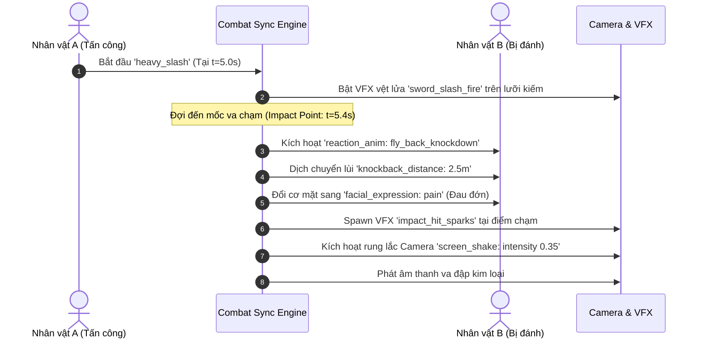

# Master Plan Toàn Diện: AI 3D Animation Studio (All-in-One Project)

Dự án là một **Studio làm phim hoạt ảnh 3D tự động hóa bằng AI**, nơi AI đóng vai trò Đạo diễn toàn năng. Dự án được xây dựng toàn bộ bằng **TypeScript + Three.js + WebCodecs** để đạt hiệu năng tối đa (Live Preview 60-120fps trên GPU, Render video MP4 siêu tốc 300-500fps). AI tự động quét kho tài nguyên, hiểu không gian map, tự biên đạo chuyển động (né vật cản, ngồi ghế, trèo cây, gieo hạt nảy mầm, combat võ thuật có hiệu ứng va chạm chi tiết), quản lý thoại với `audio_path: null` để tự động render Text-to-Speech (TTS), hiển thị phụ đề trực quan để kiểm tra cử động miệng và xuất video hoàn chỉnh.

---

## 1. Ma Trận Tính Năng Hệ Thống (Feature Matrix)

| Nhóm Tính Năng | Cơ Chế Xử Lý | Mục Tiêu Đạt Được |
| :--- | :--- | :--- |
| **Ngôn Ngữ & Hiệu Năng** | **TypeScript + WebCodecs API** | Render GPU phần cứng (NVENC/QuickSync) xuất video 4K siêu tốc, Live Preview 60-120fps mượt mà không độ trễ. |
| **Asset Discovery** | Tự động quét `public/assets/` sinh `asset_catalog.json` | AI biết chính xác có bao nhiêu nhân vật, trang phục, vũ khí, hiệu ứng, animation và cách dùng. |
| **Hệ Thống Phụ Đề (Subtitles)** | `SubtitleOverlay` + Click-to-Inspect | Bật/tắt phụ đề `[CC]`, hiển thị tên người nói; bấm vào câu thoại để phóng to mặt kiểm tra biểu cảm/khẩu hình; in cứng lên video hoặc xuất file `.srt`. |
| **Dialogue & TTS Pipeline** | Quản lý text thoại với `audio_path: null` + Auto Fill | AI xuất kịch bản thoại với audio trống; sau khi render TTS sẽ tự động điền path và cập nhật duration cho timeline & lip-sync. |
| **Combat & Tác động lực** | `CombatSyncEngine` + Hit Impact Frame + Screen Shake | Đòn đánh vung kiếm (VFX vệt sáng) -> Khớp đúng millisecond va chạm -> Đối thủ văng lùi, đổi mặt đau đớn, nổ tia lửa VFX, rung camera. |
| **Không gian & Va chạm** | `three-pathfinding` (NavMesh) + `SpatialRegistry` | AI hiểu tọa độ cây cối, bờ tường; nhân vật tự đi vòng né vật cản, không bị đi xuyên tường. |
| **Smart Objects** | `SmartSocketRegistry` (Ghế, Cây, Ruộng) | Ngồi ghế tự căn góc xoay mông; trèo cây theo đường dốc cành; ruộng đất gieo hạt và nảy mầm theo giây. |
| **Biểu cảm & Thoại** | 52 Blendshapes VRM + `VisemeLipSync` + `LookAt IK` | Mở miệng theo âm thanh thoại (A-I-U-E-O), chớp mắt tự nhiên, đổi cảm xúc, mắt nhìn theo mục tiêu. |
| **Chuẩn Code** | Strict Modularization (< 800 - 1000 dòng/file) | Tách nhỏ logic độc lập, dễ mở rộng và bảo trì lâu dài. |

---

## 2. Hệ Thống Phụ Đề & Kiểm Tra Biểu Cảm (Subtitles & Lip-Sync Inspection)

Hệ thống phụ đề đóng vai trò là công cụ kiểm định chất lượng (Quality Assurance) trực quan ngay trên màn hình Preview:

```mermaid
flowchart LR
    A[Timeline Clock] --> B[Subtitle Synchronizer]
    B --> C[Subtitle Overlay trên 3D Canvas\n(Bật/Tắt nút CC, Badge người nói, Text có đổ bóng)]
    B --> D[Bảng Subtitle List bên cạnh\n(Click vào câu thoại -> Camera tự phóng to cận cảnh mặt)]
    C --> E{Tùy chọn Xuất Video}
    E -->|Chế độ 1| F[Burn-in Subtitles: In cứng chữ sắc nét lên khung hình MP4]
    E -->|Chế độ 2| G[Export file rời .SRT / .VTT]
```

### Các tính năng phụ đề chuyên sâu:
1. **Hiển thị trực tiếp trên Canvas 3D (`SubtitleOverlay`):**
   * Hiển thị phụ đề ở cạnh dưới màn hình với kiểu chữ hiện đại, có viền đen và đổ bóng (`text-shadow`) giúp không bao giờ bị chìm trên nền sáng.
   * Gắn nhãn nhân vật phát ngôn (Ví dụ: `[Chiến Binh]: Ngươi đã chuẩn bị tinh thần chưa?`).
   * Nút bật/tắt `[CC]` tiện lợi trên thanh điều khiển.
2. **Tính năng "Bấm để soi biểu cảm" (Click-to-Inspect):**
   * Trong danh sách câu thoại, khi bạn bấm vào bất kỳ dòng phụ đề nào:
     * Con trỏ Timeline tự động nhảy đến đúng giây bắt đầu câu thoại.
     * Camera tự động chuyển sang góc cận cảnh khuôn mặt (Face Close-Up) để bạn soi xem: Khẩu hình môi (`A-I-U-E-O`) và biểu cảm cơ mặt (`tức giận, vui, buồn`) có ăn khớp với câu thoại hay không.
3. **Tùy chọn Xuất Phụ Đề:**
   * **In cứng (Burn-in):** Vẽ trực tiếp phụ đề vào từng khung hình của file video MP4.
   * **Xuất file rời:** Tự động tạo file `subtitles.srt` hoặc `subtitles.vtt` chuẩn quốc tế để tải lên YouTube / TikTok / Facebook.

---

## 3. Hệ Thống Combat & Tác Động Lực Đồng Bộ (Combat Choreography)

Cảnh chiến đấu (Combat) giữa các nhân vật đòi hỏi sự chính xác tuyệt đối đến từng khung hình:



---

## 4. Pipeline Quản Lý Lời Thoại & Quy Tắc `audio_path: null` (TTS Pipeline)

1. **Trạng thái ban đầu trong JSON (AI sinh ra với audio trống):**
   ```json
   {
     "line_id": "dlg_01",
     "speaker_id": "actor_warrior",
     "text": "Ngươi đã chuẩn bị tinh thần để đền tội chưa?",
     "voice_config": { "voice_id": "vi-VN-NamMinhNeural", "speed": 1.05, "emotion": "angry" },
     "audio_path": null,
     "audio_naming_rule": "audio/dialogues/{scene_id}_{speaker_id}_{line_id}.mp3",
     "status": "pending_tts",
     "start_time": 2.0,
     "estimated_duration": 3.0
   }
   ```
2. **Xem trước tức thì (`WebSpeechPreviewer`):** Dùng Web Speech API tích hợp sẵn trong trình duyệt để phát giọng đọc tạm và mô phỏng cử động môi ngay lập tức mà không cần chờ render file.
3. **Quy trình Auto-Fill (Sau khi bấm nút "Render TTS"):**
   * Script gọi API TTS sinh file MP3 theo `audio_naming_rule`.
   * Đo chính xác độ dài thực tế của file MP3 (VD: `3.25s`) và tự động thay `audio_path: "audio/dialogues/scene_01_actor_warrior_dlg_01.mp3"` vào JSON.
   * `ActorLipSync` lập tức phân tích file MP3 này để tạo 52 Visemes chuẩn xác từng mili-giây.

---

## 5. Hệ Thống Tương Tác Vật Thể Thông Minh & Tránh Va Chạm

1. **Ngồi ghế chuẩn xác (`ChairInteraction`):** Nhân vật chạy đến `seat_entry` -> Tự xoay 180° mặt hướng ra ngoài -> Khớp hông vào `sit_target` -> Chuyển sang animation ngồi, không lo bị lơ lửng hay xuyên ghế.
2. **Trèo cây (`ClimbingInteraction`):** Nhân vật chuyển sang animation leo trèo, tọa độ nâng dần theo trục thân cây lên nhánh chạc ba (`branch_seat`) rồi ngồi nghỉ.
3. **Mảnh ruộng & Nảy mầm theo thời gian (`FarmingSystem`):** Nhân vật cúi người gieo hạt -> Spawn mầm cây `sprout.glb` với animation scale từ `0.0 -> 1.0` tăng dần theo mốc giây trên Timeline.
4. **NavMesh Pathfinding:** Bản đồ có lưới đi bộ được đục lỗ tại cây cối, bờ tường. Thuật toán **A* Search** (`three-pathfinding`) tự động lái nhân vật đi vòng qua các chướng ngại vật mượt mà.

---

## 6. Bản Thiết Kế Master JSON Schema Toàn Năng (Đầy Đủ Nhất)

```json
{
  "scene_id": "scene_village_clash",
  "fps": 30,
  "duration": 25.0,
  "environment": {
    "map": "farming_village",
    "sky_time": "sunset",
    "weather": { "fog": 0.01, "wind": 0.3 }
  },
  "subtitles_config": {
    "enable_overlay": true,
    "burn_in_export": true,
    "font_size": 24,
    "show_speaker_name": true
  },
  "dialogues_manifest": [
    {
      "line_id": "dlg_01",
      "speaker_id": "actor_warrior",
      "speaker_name": "Chiến Binh",
      "speaker_color": "#eab308",
      "text": "Ngươi đã chuẩn bị tinh thần để đền tội chưa?",
      "voice_config": { "voice_id": "vi-VN-NamMinhNeural", "speed": 1.05, "emotion": "angry" },
      "audio_path": null,
      "audio_naming_rule": "audio/dialogues/{scene_id}_{speaker_id}_{line_id}.mp3",
      "status": "pending_tts",
      "start_time": 2.0,
      "estimated_duration": 3.0
    },
    {
      "line_id": "dlg_02",
      "speaker_id": "actor_dark_mage",
      "speaker_name": "Phù Thủy Tối Thượng",
      "speaker_color": "#a855f7",
      "text": "Ha ha! Một kẻ như ngươi mà cũng đòi cản đường ta sao?",
      "voice_config": { "voice_id": "vi-VN-HoaiMyNeural", "speed": 1.0, "pitch": 0.1, "emotion": "arrogant" },
      "audio_path": null,
      "audio_naming_rule": "audio/dialogues/{scene_id}_{speaker_id}_{line_id}.mp3",
      "status": "pending_tts",
      "start_time": 5.5,
      "estimated_duration": 4.0
    }
  ],
  "camera_tracks": [
    {
      "start": 0.0, "end": 5.0,
      "shot_type": "cinematic_dolly",
      "from": [-5, 3, 10], "to": [-1, 1.8, 4],
      "look_at": "actor_warrior.head", "fov": 45
    },
    {
      "start": 8.0, "end": 14.0,
      "shot_type": "combat_action_cam",
      "follow_target": "actor_warrior",
      "distance": 3.5, "height": 1.6, "fov": 60
    }
  ],
  "actors": [
    {
      "id": "actor_warrior",
      "model": "characters/hero_knight.vrm",
      "costume": "default_armor",
      "spawn_point": [-3, 0, 2],
      "tracks": {
        "movement": [
          { "start": 0.0, "end": 2.0, "action": "walk", "destination": [0, 0, 2], "avoid_obstacles": true },
          { "start": 2.0, "end": 8.5, "action": "talk_gesture", "look_at": "actor_dark_mage.head" }
        ],
        "speech": [
          {
            "line_ref": "dlg_01",
            "expressions": [
              { "time_offset": 0.0, "type": "angry", "weight": 1.0 },
              { "time_offset": 2.0, "type": "serious", "weight": 0.8 }
            ]
          }
        ],
        "combat_actions": [
          {
            "start_time": 8.5,
            "impact_time": 9.1,
            "anim": "heavy_slash_combo",
            "weapon_vfx": { "type": "sword_slash_fire", "start": 8.6, "end": 9.3 },
            "target": {
              "actor_id": "actor_dark_mage",
              "reaction_anim": "fly_back_knockdown",
              "knockback_distance": 2.5,
              "facial_expression": "pain",
              "impact_vfx": "impact_hit_sparks",
              "screen_shake": { "intensity": 0.35, "duration": 0.25 }
            }
          }
        ]
      }
    },
    {
      "id": "actor_dark_mage",
      "model": "characters/dark_mage.vrm",
      "spawn_point": [2, 0, 2],
      "tracks": {
        "movement": [
          { "start": 0.0, "end": 8.5, "action": "idle", "look_at": "actor_warrior.head" }
        ],
        "speech": [
          {
            "line_ref": "dlg_02",
            "expressions": [
              { "time_offset": 0.0, "type": "smirk", "weight": 0.9 }
            ]
          }
        ],
        "vfx": [
          { "start": 7.0, "end": 8.5, "type": "magic_shield_barrier", "attach_to": "root" }
        ]
      }
    }
  ],
  "dynamic_world_events": [
    {
      "target": "props.farm_plot_01.crop",
      "growth_timeline": [
        { "time": 2.0, "stage": "seed", "scale": 0.1 },
        { "time": 8.0, "stage": "sprout", "scale": 0.6 },
        { "time": 18.0, "stage": "mature_crop", "scale": 1.0 }
      ]
    }
  ]
}
```

---

## 7. Quy Chuẩn Phân Rã Code Chặt Chẽ (Code Modularization Standards)

> [!IMPORTANT]
> **Quy Tắc Kiến Trúc Bắt Buộc:**
> 1. **Giới hạn số dòng tối đa:** Tuyệt đối **KHÔNG vượt quá 800 - 1000 dòng/file**.
> 2. **Chủ động phân tách:** File đạt từ **400 - 600 dòng** phải phân tách thành các module/class chuyên biệt.
> 3. **Mỗi file chỉ làm 1 việc duy nhất (Single Responsibility).**

### Bảng Phân Rã Toàn Bộ File Dự Án (TypeScript + React + Three.js):

```
src/
├── core/
│   ├── engine/
│   │   ├── ThreeRenderer.ts           # Khởi tạo WebGL Renderer & Canvas (~140 dòng)
│   │   ├── SceneLighting.ts           # Hệ thống ánh sáng mặt trời, skybox, bóng (~120 dòng)
│   │   └── PostProcessor.ts           # Cinematic DOF, Bloom, Screen Shake (~160 dòng)
│   ├── assets/
│   │   ├── AssetScanner.ts            # Quét thư mục assets tạo catalog JSON (~150 dòng)
│   │   ├── AssetLoaderRegistry.ts     # Cache loader cho GLTF, VRM, Audio, Textures (~180 dòng)
│   │   └── SocketAttacher.ts          # Gắn vũ khí, VFX vào xương (Bone Sockets) (~130 dòng)
│   ├── audio_tts/
│   │   ├── DialogueExtractor.ts       # Quản lý danh sách thoại, xuất file manifest (~120 dòng)
│   │   ├── TTSBatchGenerator.ts       # Gọi API Edge-TTS / ElevenLabs sinh file MP3 (~180 dòng)
│   │   ├── AudioAutoFiller.ts         # Tự động điền audio_path & duration sau render (~110 dòng)
│   │   └── WebSpeechPreviewer.ts      # Giọng đọc nháp Web Speech API xem trước tức thì (~100 dòng)
│   ├── subtitles/
│   │   ├── SubtitleSynchronizer.ts    # Đồng bộ subtitle theo thời gian thực (~130 dòng)
│   │   ├── SubtitleSRTExporter.ts     # Xuất file .SRT / .VTT chuẩn quốc tế (~110 dòng)
│   │   └── SubtitleCanvasBurner.ts    # Vẽ in cứng phụ đề vào từng khung hình video (~140 dòng)
│   ├── actors/
│   │   ├── VRMAvatar.ts               # Quản lý avatar VRM, xương, physics tóc (~180 dòng)
│   │   ├── ActorAnimator.ts           # Quản lý Animation Mixer & Crossfade (~190 dòng)
│   │   ├── ActorMorphController.ts    # 52 Blendshapes biểu cảm (vui, giận, đau) (~150 dòng)
│   │   ├── ActorLipSync.ts            # Phân tích Audio -> Viseme A-I-U-E-O (~170 dòng)
│   │   └── ActorLookAt.ts             # IK hướng nhìn mắt & đầu theo vật thể (~120 dòng)
│   ├── combat/
│   │   ├── CombatSyncEngine.ts        # Khớp đòn đánh -> Frame va chạm -> Hit Reaction (~210 dòng)
│   │   ├── HitBoxDetector.ts          # Tính toán khoảng cách và góc va chạm (~140 dòng)
│   │   └── CombatVFXTrigger.ts        # Kích hoạt vệt chém, tia lửa, chưởng lực (~160 dòng)
│   ├── interactions/
│   │   ├── SmartSocketRegistry.ts     # Danh bạ socket đồ vật (ghế, bàn, cây) (~130 dòng)
│   │   ├── ChairInteraction.ts        # Logic căn góc xoay và ngồi ghế mượt mà (~150 dòng)
│   │   ├── ClimbingInteraction.ts     # Logic bám và trèo cây theo waypoints (~190 dòng)
│   │   └── FarmingSystem.ts           # Logic ô đất, gieo hạt, cây nảy mầm theo giây (~180 dòng)
│   ├── navigation/
│   │   ├── NavMeshManager.ts          # Khởi tạo lưới đi bộ từ Map (~160 dòng)
│   │   └── PathNavigator.ts           # Lái nhân vật né chướng ngại vật bằng A* (~200 dòng)
│   ├── timeline/
│   │   ├── MasterClock.ts             # Đồng hồ Play/Pause/Scrubbing Timeline (~130 dòng)
│   │   └── TrackEvaluator.ts          # Bộ phân tích thực thi đa luồng bất đồng bộ (~220 dòng)
│   ├── camera/
│   │   ├── CameraDirector.ts          # Điều phối chuyển đổi camera theo kịch bản (~180 dòng)
│   │   └── CameraFraming.ts           # Tính toán góc cận cảnh, toàn cảnh, theo dõi (~150 dòng)
│   └── export/
│       ├── WebCodecsRecorder.ts       # Trích xuất video MP4 tăng tốc phần cứng GPU (~190 dòng)
│       └── VideoMuxer.ts              # Ghép hình ảnh + Âm thanh TTS thành MP4 (~150 dòng)
├── ai/
│   ├── catalog_exporter.ts            # Xuất tài nguyên gửi vào Prompt AI (~140 dòng)
│   ├── spatial_scanner.ts             # Quét tọa độ chướng ngại vật gửi AI (~160 dòng)
│   └── prompt_builder.ts              # Tạo System Prompt Đạo Diễn cho AI (~150 dòng)
└── ui/
    ├── ViewportCanvas.tsx             # Màn hình Live Preview 3D (~140 dòng)
    ├── SubtitleOverlay.tsx            # Lớp hiển thị phụ đề trực tiếp trên màn hình (~120 dòng)
    ├── SubtitleInspector.tsx          # Danh sách thoại: Bấm vào câu để soi biểu cảm (~160 dòng)
    ├── TimelineScrubber.tsx           # Thanh tua thời gian đa tầng (~180 dòng)
    ├── DialogueEditorModal.tsx        # Bảng quản lý thoại & nút bấm Render TTS (~160 dòng)
    ├── MapRadarView.tsx               # Radar 2D soi chướng ngại vật & nhân vật (~190 dòng)
    └── AIChatDirector.tsx             # Khung chat với AI Đạo Diễn (~170 dòng)
```

---

## 8. Lộ Trình Triển Khai Thực Thi

1. **Giai đoạn 1 (Foundation, Asset Discovery & TypeScript Setup):** Khởi tạo khung Vite + React + TypeScript + Three.js; Xây dựng `AssetScanner` và `AssetLoaderRegistry`.
2. **Giai đoạn 2 (Dialogue, Subtitles & TTS Pipeline):** Xây dựng `DialogueExtractor`, `TTSBatchGenerator`, `AudioAutoFiller`, `SubtitleOverlay` và `SubtitleInspector`.
3. **Giai đoạn 3 (Navigation & Smart Sockets):** Tích hợp NavMesh né cây/tường; hoàn thiện logic ngồi ghế, trèo cây và làm nông nảy mầm.
4. **Giai đoạn 4 (Combat Engine & VFX Synchronization):** Xây dựng `CombatSyncEngine` kết nối đòn đánh, vệt chém, va đập, knockback và rung màn hình.
5. **Giai đoạn 5 (Facial Morphs, Lip-sync & Timeline):** Tích hợp cử động miệng A-I-U-E-O theo file âm thanh TTS và đồng hồ timeline bất đồng bộ.
6. **Giai đoạn 6 (WebCodecs Export, AI Integration & Studio UI):** Tích hợp AI Prompt Builder sinh JSON Master; hoàn thiện UI Live Preview 60fps và xuất Video MP4 qua `WebCodecsRecorder`.
